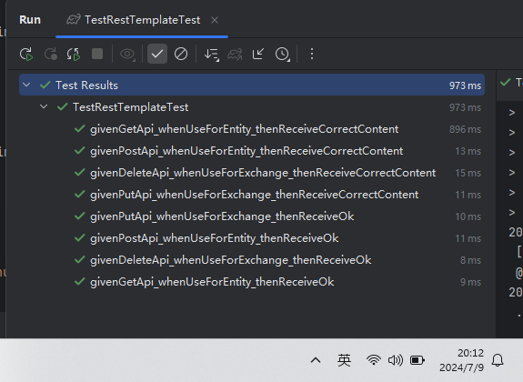
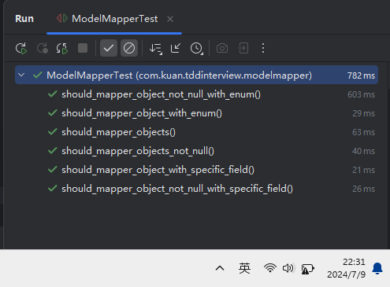
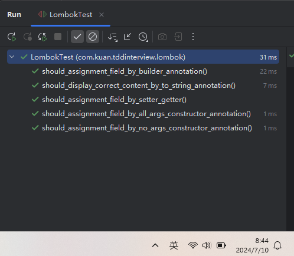

# TDD 技能

思维方面：
1. 必须是先写一个失败的测试，运行一次，失败了再写实现代码
2. 必须是先实现，再重构，禁止一切提前写实现的方式
3. 当发现2处重复时，马上重构代码（对于idea的重构功能要求很高）

步骤方面：
- 写新功能时
    - 先运行全部测试，确保是通过的再写新代码
    - 先从happy path出发，再到sad path
    - 先从最简单的receiveOK，再到保存到数据库，再到每一个字段的一些简单逻辑
    - 严格按照思维方面的要求执行
- 重构老功能
    - 先运行全部测试，确保是通过的再写新代码
    - 重构功能，并经常运行测试

须要掌握的技能：
- Idea重构功能的使用
    - 抽方法
    - 提取参数
    - 抽变量
    - 移动方法到对象，并且处理冲突
- [&#x2714;] springboot test这边需要掌握的
    - [&#x2714;] TestRestTemplate提交数据的各种模式（get、post、put、delete） 
    - [&#x2714;] 全局exception处理
    - [&#x2714;] 一个需要登陆的接口怎么TDD
    - [&#x2714;] 一个有分页的接口怎么TDD
    - [&#x2714;] 国际化怎么做的
    - [&#x2714;] validation怎么做
    - [&#x2714;] 抛出异常怎么做
    - [&#x2714;] 各种Controller参数获取怎么操作
    - [&#x2714;] 参数化测试怎么做
- Mock需要掌握的
    - mock service、repository怎么做
    - Mock 第三方http接口怎么做
- spring data Jpa需要掌握的
    - [&#x2714;] 精通OneToOne，关联表的设置，不同cascade type在存储、删除时的效果
    - [&#x2714;] 精通OneToMany，ManyToOne，关联表，不同cascade type在存储、删除时的效果
    - [&#x2714;] 精通ManyToMany，关联表，不同cascade type在存储、删除时的效果
    - [&#x2714;] Entity继承的三种表现
    - 以上可以在这个系列视频学习 https://www.youtube.com/watch?v=9ME94z46fsU&list=PLG5RS5k7TfUqDHBklOB35W3MamGLBLJQW
    - 精通解决n+1的4种方法 https://www.bilibili.com/video/BV1x24y1z7bd?p=26&vd_source=9232efce708d84b3864e12befa5f2526
    - 精通specification和criterial api的使用
    - 精通pageable
    - CreatedAt, UpdatedAt的设置
    - LocalDateTime的使用
    - EnumType的使用
- [&#x2714;] Entity到DTO
    -  [&#x2714;] 精通第三方自动化转化方案如modelmapper
- Jackson
    - 精通处理对象循环依赖处理
    - 精通json字段到对象转化
    - 精通读取想要的指定格式
- [&#x2714;] Lombok
    - [&#x2714;] 精通使用lombok的各项功能
- H2
    - 能看懂出错的冲突限制

选择掌握的技能（提速）：
- Vim按键的使用

# 测试结果
1. TestRestTemplate提交数据的各种模式（get、post、put、delete）

2. 精通第三方自动化转化方案如modelmapper

3. 精通使用lombok的各项功能(getter\setter\constructor\builder)
